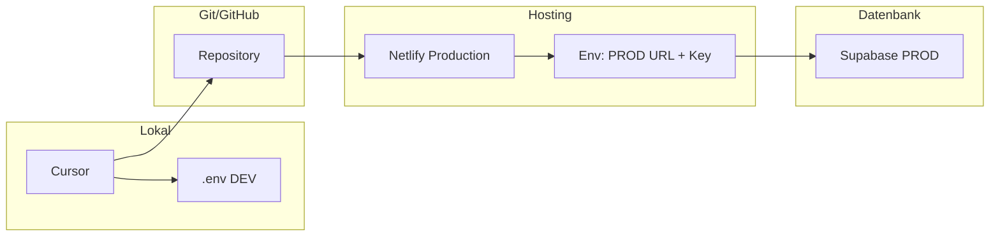

> **Hinweis (Betrieb heute, 2026):** Live-Hosting läuft nur noch über **Cloudflare** (siehe `wrangler.toml` und [ENVIRONMENTS.md](ENVIRONMENTS.md)). **Netlify ist deaktiviert.**  
> Dieses Dokument bleibt als **Archiv** für den historischen Wechsel Bolt → Netlify lesbar; neue Schritte bitte nicht mehr gegen Netlify ausrichten.

---

# Workflow: Von Bolt zu Netlify – bis zur Live-Stellung

Vollständiger, kleinteiliger Workflow zum Wechsel von Bolt auf Netlify: Netlify-Ersteinrichtung, PROD-Datenbank hinterlegen, ersten Deploy, parallele Prüfung und schrittweise Live-Stellung ohne eigene Domain (Netlify-Subdomain).

---

## Ausgangslage

- App läuft aktuell über **Bolt** (Live-Site nutzt PROD-Supabase).
  - **Aktuelle Bolt-Live-URL:** <https://andrethaller-ctrl-yo-gpke.bolt.host/>
- **Netlify** ist noch nicht eingerichtet.
- Ziel: In Cursor entwickeln → nach GitHub committen → **nur noch Netlify** deployen; PROD-Datenbank ausschließlich über Netlify-Env-Variablen anbinden.
- Domain: Zuerst mit **Netlify-Subdomain** (z.B. `yogaflow.netlify.app`) live gehen; eigene Domain später möglich.

Die App entscheidet nur über die Umgebungsvariablen `VITE_SUPABASE_URL` und `VITE_SUPABASE_ANON_KEY`, welche Datenbank genutzt wird. Wo diese gesetzt werden (Bolt vs. Netlify), bestimmt, wo die „Live-DB“ hinterlegt ist.

---

## Phase 1: Netlify-Ersteinrichtung

### 1.1 Netlify-Account

- Falls noch kein Account: Auf [netlify.com](https://www.netlify.com) gehen, **Sign up** (z.B. mit GitHub-Login, dann ist Repo-Zugriff direkt möglich).
- Nach dem Login: Dashboard (Team/Personal) öffnen.

### 1.2 Neue Site aus GitHub erstellen

- Im Netlify-Dashboard: **Add new site** → **Import an existing project**.
- **Connect to Git provider** → **GitHub** auswählen und Zugriff für Netlify erlauben (ggf. nur dieses Repo freigeben).
- Repository auswählen: das tatsächliche YogaFlow-Repo (heute: **YogaFlow/YogaFlow-DEV**).
- **Branch to deploy:** `main` (oder den Branch, der eure Produktion darstellt).
- Build-Einstellungen (historisch): Netlify nutzte eine `netlify.toml` mit `npm run build` und `publish = "dist"` (diese Datei ist im aktuellen Repo entfernt; Live nutzt **Cloudflare** und [wrangler.toml](../wrangler.toml)).
  - `command = "npm run build"`
  - `publish = "dist"` (Netlify-Terminologie; auf Cloudflare entspricht das dem Asset-Ordner `dist/` in Wrangler.)
- **Deploy site** / **Save** klicken (nur relevant, falls ihr das Archiv nachstellt).
- Erster Build startet. Er wird **ohne** Supabase-Variablen laufen und kann fehlschlagen oder eine App ohne DB-Anbindung liefern – das wird in **Phase 2** behoben (PROD-Env-Variablen setzen).

### 1.3 Netlify-Subdomain (später eure „Live-URL“)

- Nach dem ersten Deploy (oder nach Phase 2): Unter **Site configuration** → **Domain management** steht die Standard-URL, z.B. `irgendwas-123.netlify.app`.
- Optional: **Domain settings** → **Change site name** auf einen sinnvollen Namen setzen (z.B. `yogaflow` → `yogaflow.netlify.app`). Dieser Name ist eure Live-URL, bis ihr eine eigene Domain hinzufügt.

---

## Phase 2: PROD-Datenbank bei Netlify hinterlegen

Die PROD-Datenbank „hinterlegen“ heißt: Die **gleichen** PROD-Supabase-Zugangsdaten, die heute bei Bolt genutzt werden, in Netlify als **Production**-Umgebungsvariablen eintragen. Die Datenbank bleibt in Supabase; nur der Ort der Konfiguration wechselt von Bolt zu Netlify.

### 2.1 PROD-Credentials besorgen

- Im **Supabase-Dashboard** (supabase.com) das **PROD-Projekt** öffnen (das, mit dem die aktuelle Live-App bei Bolt verbunden ist).
- **Settings** (Zahnrad) → **API**:
  - **Project URL** kopieren (z.B. `https://xxxx.supabase.co`).
  - **Project API keys** → **anon** / **public** Key kopieren (der fürs Frontend bestimmte Key, nicht der `service_role`).
- Optional: Falls ihr die Werte aktuell nur bei Bolt seht: Dieselben Werte aus dem PROD-Supabase-Projekt unter **Settings → API** holen; sie müssen identisch sein.

### 2.2 In Netlify eintragen

- Netlify Dashboard → eure **Site** → **Site configuration** → **Environment variables** (oder **Build & deploy** → **Environment**).
- **Add a variable** / **Add environment variables**:
  - **Key:** `VITE_SUPABASE_URL`  
    **Value:** die kopierte PROD-Project-URL  
    **Scopes:** nur **Production** (oder „All”) auswählen.
  - **Key:** `VITE_SUPABASE_ANON_KEY`  
    **Value:** der kopierte anon/public Key  
    **Scopes:** nur **Production**.
- **Save**.
- Wichtig: Diese Variablen gelten für **Production**-Builds. Deploy Previews (später) können separat mit DEV-Werten versehen werden.

### 2.3 Neuen Build auslösen

- **Deploys** → **Trigger deploy** → **Deploy site** (oder einen neuen Commit pushen). So wird die Site mit den gesetzten PROD-Variablen neu gebaut und die Live-URL nutzt die PROD-Datenbank.

---

## Phase 3: Prüfung (Netlify parallel zu Bolt)

### 3.1 Funktionstest auf der Netlify-URL

- Netlify-URL im Browser öffnen (z.B. `https://yogaflow.netlify.app`).
- Prüfen: Login, Navigation, alle relevanten Features, die mit der PROD-Datenbank reden (Lese-/Schreibzugriffe). Damit stellt ihr sicher, dass dieselbe PROD-DB wie bei Bolt genutzt wird und alles funktioniert.
- Zum Vergleich: Aktuelle Bolt-URL <https://andrethaller-ctrl-yo-gpke.bolt.host/> nutzt dieselbe PROD-DB – nach dem Wechsel ist die Netlify-URL die neue Live-Adresse.

### 3.2 Optional: Deploy Previews mit DEV-DB

- Unter **Environment variables** für **Deploy Previews** (oder „Branch deploys”) die **DEV**-Werte eintragen:
  - `VITE_SUPABASE_URL` = DEV-Project-URL  
  - `VITE_SUPABASE_ANON_KEY` = DEV-Anon-Key
- Dann nutzen PR-Previews die DEV-Datenbank; Production bleibt bei PROD.

---

## Phase 4: Live-Stellung (Netlify als einzige Live-Plattform)

### 4.1 Entscheidung: Netlify ist Live

- Sobald die Tests auf der Netlify-URL zufriedenstellend sind: **Netlify-URL** (z.B. `https://yogaflow.netlify.app`) als offizielle Live-URL kommunizieren bzw. nutzen.
- **Bolt** wird nicht mehr für Deploys genutzt: Keine weiteren Deployments von diesem Repo auf Bolt auslösen.
- Die bisherige **Bolt-URL** <https://andrethaller-ctrl-yo-gpke.bolt.host/> ist ab dann nicht mehr die offizielle Live-Adresse.

### 4.2 Bolt abkoppeln (konkret)

- Bei Bolt: Das Projekt mit der URL <https://andrethaller-ctrl-yo-gpke.bolt.host/> öffnen.
- Repo-Verbindung entfernen oder Deploys deaktivieren (je nach Bolt-UI: z.B. Project Settings → Disconnect repository / Pause deploys). So verhindert ihr versehentliche Deploys.
- Die bisherige Bolt-Live-URL kann bestehen bleiben oder irgendwann abgeschaltet werden; die „echte“ Live-App läuft ab jetzt über Netlify.

### 4.3 Dokumentation und Alltag

- In [ENVIRONMENTS.md](ENVIRONMENTS.md) steht bereits: Lokal = DEV (.env), Netlify Production = PROD. Keine Änderung nötig; nur sicherstellen, dass alle Beteiligten nur noch Netlify für Live-Deploys nutzen.
- Ablauf ab dann: **Cursor** (Entwicklung, lokale .env = DEV) → **Git** (Commit/Push) → **GitHub** (main) → **Netlify** (automatischer Deploy von main, Production-Env = PROD). Schema-Änderungen auf PROD weiterhin manuell nach [DEV_PROD_SAFETY_WORKFLOW.md](DEV_PROD_SAFETY_WORKFLOW.md) (Pre-PROD-Checkliste, `supabase link` auf PROD, `db push`).

---

## Phase 5: Optional – Aufräumen im Repo

- Ordner `.bolt/` im Projektroot enthält nur `config.json` mit dem Template-Namen. Er wird für Build/Deploy nicht benötigt.
- Optional: `.bolt/` löschen und den Lösch-Commit pushen, wenn ihr Bolt vollständig aus dem Projekt entfernen wollt. Kein Muss für den Wechsel zu Netlify.

---

## Übersicht: Wo was liegt

- **Lokal:** Nur DEV in `.env`; `supabase link` / `db:push` standardmäßig auf DEV.
- **Netlify Production:** Env-Variablen = PROD → Verbindung zur PROD-Datenbank. Damit ist die PROD-Datenbank „bei Netlify hinterlegt“ (nur die Konfiguration, die DB bleibt bei Supabase).
- **Bolt:** Nach dem Wechsel nicht mehr für Deploys genutzt; Repo dort abkoppeln/deaktivieren. Bisherige URL: <https://andrethaller-ctrl-yo-gpke.bolt.host/>

---

## Checkliste bis zur Live-Stellung (Kurzfassung)

1. Netlify-Account anlegen (ggf. mit GitHub).
2. Site aus GitHub-Repo erstellen, Branch `main`, Build wie in der damaligen `netlify.toml` (heute: Cloudflare + `wrangler.toml`).
3. PROD-URL und PROD-Anon-Key aus Supabase (PROD-Projekt) kopieren.
4. In Netlify unter Production: `VITE_SUPABASE_URL` und `VITE_SUPABASE_ANON_KEY` setzen.
5. Deploy auslösen und Netlify-URL testen (Login, Features).
6. Netlify-URL als Live-URL nutzen; Bolt-Deploys stoppen/Repo abkoppeln (Bolt-URL: <https://andrethaller-ctrl-yo-gpke.bolt.host/>).
7. Optional: `.bolt/` im Repo entfernen.
8. Später: Eigene Domain in Netlify hinzufügen (Domain management), wenn gewünscht.

Damit seid ihr von Bolt weg und nutzt nur noch Netlify für die Live-Stellung; die PROD-Datenbank ist ausschließlich über Netlify-Umgebungsvariablen angebunden.
