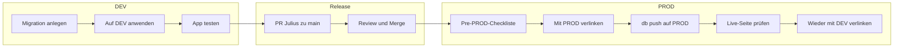

# DEV→PROD Safety-Workflow: Sicherheitsschritte für die Datenbank

Diese Übersicht bündelt die **Sicherheitsprinzipien** und **Checklisten**, die sicherstellen, dass beim Deploy von DEV zu PROD nichts kaputt geht und keine echten Daten gelöscht oder überschrieben werden.

---

## Sicherheitsprinzipien

- **Lokal nur DEV:** Die Datei `.env` enthält nur DEV-Supabase-URL und DEV-Anon-Key. PROD-Keys werden **niemals** im Repo oder in `.env` gespeichert.
- **Schema nur über Migrationen:** Alle Schema-Änderungen laufen über Migrationsdateien in `supabase/migrations/`. Migrationen enthalten nur **Struktur** (CREATE TABLE, ALTER TABLE, RLS, Indizes usw.) – **keine** DELETE/UPDATE/INSERT auf echte Nutzerdaten. Daten-Änderungen erfolgen nur über die App oder bewusst geplante Skripte.
- **PROD-Schema nur bewusst:** Die PROD-Datenbank wird **nicht** automatisch mit dem Netlify-Deploy geändert. Migrationen auf PROD wendet ihr **manuell** und nur **nach Merge** an – mit Backup-Check und in der richtigen Reihenfolge.
- **Netlify ≠ Datenbank:** Netlify deployed nur den **Code**. Die Datenbank-Struktur (Schema) bleibt unverändert, bis ihr `supabase db push` (oder SQL im PROD-Dashboard) bewusst ausführt.

---

## Pre-PROD-Checkliste (vor jedem PROD-`db push`)

Vor dem Anwenden von Migrationen auf PROD diese Punkte abhaken:

- [ ] **PR ist gemerged**, und ihr arbeitet mit aktuellem `main`: `git checkout main` und `git pull origin main`.
- [ ] **Backup geprüft:** Im Supabase-Dashboard des **PROD**-Projekts prüfen, ob Backups aktiv sind (Settings → Backups). Bei kritischen Änderungen: Zeitpunkt notieren.
- [ ] **Mit PROD verlinkt:** `supabase link --project-ref <PROD-Projekt-Ref>` ausführen (PROD-Ref aus PROD-Dashboard, PROD-Datenbank-Passwort eingeben). **Erst danach** `supabase db push`.
- [ ] **Nach dem Push:** Live-Seite im Browser prüfen (Login, betroffene Features). Anschließend **wieder mit DEV verlinken:** `supabase link --project-ref <DEV-Projekt-Ref>`, damit der nächste Push nicht versehentlich PROD trifft.

---

## Vor dem PROD-Push: Git und Migrationen

- **Branch:** Nur von **main** aus Migrationen auf PROD anwenden. Vorher: `git branch` – aktueller Branch sollte `main` sein; `git status` – sauber oder nur erwartete Dateien.
- **main aktuell:** `git pull origin main`, damit die gleichen Migrationsdateien wie auf PROD angewendet werden sollen auch lokal vorhanden sind.
- **Welche Migrationen laufen?** Die Supabase-CLI führt bei `supabase db push` nur **noch nicht auf der verlinkten Datenbank ausgeführte** Migrationen aus (Reihenfolge nach Zeitstempel im Dateinamen). Welche Migrationen auf PROD schon gelaufen sind, steht in der Tabelle `supabase_migrations.schema_migrations` im PROD-Dashboard (SQL Editor: `SELECT * FROM supabase_migrations.schema_migrations ORDER BY version;`). Optional vor dem Push prüfen, um die Liste der ausstehenden Migrationen im Kopf zu haben.

---

## Ablauf (Übersicht)

1. **Migration anlegen** (lokal auf Julius) → **auf DEV anwenden** und **App testen**.
2. **PR** von Julius → main, **Review**, **Merge**. Die PROD-Datenbank ist zu diesem Zeitpunkt noch unverändert.
3. **Pre-PROD-Checkliste** abhaken, **mit PROD verlinken**, **db push** ausführen, **Live-Seite prüfen**, **wieder mit DEV verlinken**.

---

## Verweise

| Thema | Dokument |
|--------|----------|
| Schema-Änderungen von DEV nach PROD (Ablauf) | [SCHEMA_RELEASE_WORKFLOW.md](SCHEMA_RELEASE_WORKFLOW.md) |
| Datenbank-Workflow Schritt für Schritt (Agent vs. Du, CLI) | [DATABASE_WORKFLOW_SCHRITT_FÜR_SCHRITT.md](DATABASE_WORKFLOW_SCHRITT_FÜR_SCHRITT.md) |
| Schema-Rollback (Gegen-Migration, Backup) | [SCHEMA_ROLLBACK_WORKFLOW.md](SCHEMA_ROLLBACK_WORKFLOW.md) |
| Code-Rollback (main zurücksetzen) | [ROLLBACK.md](ROLLBACK.md) |
| DEV vs. PROD, Env-Variablen, Verlinkung | [ENVIRONMENTS.md](ENVIRONMENTS.md) |
