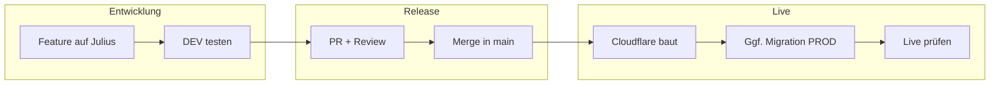

# Vollständiger Workflow: Von der Einrichtung bis zum Live-Deploy

Diese Anleitung führt dich und deinen Partner **Schritt für Schritt** durch den gesamten Prozess: von der ersten Einrichtung bis zum sicheren Live-Deploy neuer Features. Alle Schritte sind kleinteilig beschrieben und so formuliert, dass auch jemand ohne technische Vorkenntnisse sie nachvollziehen kann.

---

## Inhaltsverzeichnis

1. [Einleitung](#einleitung)
2. [Teil A: Einmalige Einrichtung](#teil-a-einmalige-einrichtung)
   - [A1 – Voraussetzungen](#a1--voraussetzungen)
   - [A2 – Repository](#a2--repository)
   - [A3 – Umgebung lokal (DEV-Datenbank)](#a3--umgebung-lokal-dev-datenbank)
   - [A4 – Supabase CLI (einmalig)](#a4--supabase-cli-einmalig)
   - [A5 – Cloudflare (Live-Deploy, einmalig)](#a5--cloudflare-live-deploy-einmalig)
   - [A6 – GitHub Branch Protection](#a6--github-branch-protection)
3. [Teil B: Wiederkehrender Ablauf – Neues Feature bis Live](#teil-b-wiederkehrender-ablauf--neues-feature-bis-live)
   - [B1 – Ausgangslage](#b1--ausgangslage)
   - [B2 – Feature in Cursor entwickeln](#b2--feature-in-cursor-entwickeln)
   - [B3 – Schema-Änderung (Migration) – nur wenn nötig](#b3--schema-änderung-migration--nur-wenn-nötig)
   - [B4 – Änderungen ins Repo bringen](#b4--änderungen-ins-repo-bringen)
   - [B5 – Nach dem Merge: Cloudflare und Code live](#b5--nach-dem-merge-cloudflare-und-code-live)
   - [B6 – Migrationen auf PROD anwenden (bewusst und geplant)](#b6--migrationen-auf-prod-anwenden-bewusst-und-geplant)
   - [B7 – Agent vs. Du (Kurzüberblick)](#b7--agent-vs-du-kurzüberblick)
4. [Teil C: Wenn etwas schiefgeht](#teil-c-wenn-etwas-schiefgeht)
5. [Anhänge](#anhänge)
   - [Pre-PROD-Checkliste](#pre-prod-checkliste)
   - [Feature-Release-Checkliste / Asana-Vorlage](#feature-release-checkliste--asana-vorlage)
   - [Wichtige Links (bestehende Docs)](#wichtige-links-bestehende-docs)
   - [Glossar](#glossar)
6. [Feedback](#feedback)

---

## Einleitung

### Für wen ist diese Anleitung?

Für alle, die an der YogaFlow-App mitentwickeln oder den Prozess verstehen wollen: Wie kommen neue Features von der Idee bis sicher live? Was passiert mit der Datenbank? Was ist DEV, was ist PROD? Diese Anleitung beantwortet das in einer durchgängigen Abfolge.

### Was passiert wann – grob

- **Lokal (dein Rechner):** Du entwickelst immer gegen die **DEV**-Datenbank. Dort kannst du testen, ohne echte Nutzerdaten zu gefährden.
- **GitHub:** Der Code liegt in einem Repository. Neue Änderungen werden auf einem Branch namens **Julius** entwickelt und erst nach Prüfung (Pull Request, Review) in den Hauptbranch **main** gemerged.
- **Cloudflare:** Sobald etwas in **main** gemerged wird, baut und deployed Cloudflare (Git + Wrangler) automatisch die App. Die **Live-Seite** nutzt die **PROD**-Datenbank. Wichtig: Cloudflare ändert **nur den Code**, nicht die Datenbank-Struktur.
- **Datenbank-Struktur (Schema):** Änderungen an Tabellen, Spalten, Rechten usw. heißen „Migrationen“. Sie werden zuerst auf **DEV** getestet, dann per Pull Request ins Repo gebracht. Die **PROD**-Datenbank wird **nicht** automatisch angepasst – das machst du **bewusst und manuell** nach dem Merge, mit einer klaren Checkliste.

### Wichtige Begriffe (kurz)

| Begriff | Bedeutung |
|--------|------------|
| **Branch** | Eine Abzweigung im Code. Wir entwickeln auf dem Branch **Julius**, der Hauptstand ist **main**. |
| **Pull Request (PR)** | Vorschlag, Änderungen von einem Branch (z. B. Julius) in einen anderen (main) zu übernehmen. Erst nach Review und Freigabe wird gemerged. |
| **Merge** | Das Zusammenführen von Änderungen (z. B. Julius → main). Nach Merge startet Cloudflare einen neuen Live-Build. |
| **Migration** | Eine SQL-Datei, die die Datenbank-Struktur ändert (neue Tabelle, neue Spalte, Rechte usw.). Liegt im Ordner `supabase/migrations/`. |
| **Env-Variablen** | Konfigurationswerte (z. B. Datenbank-URL und Schlüssel). Lokal in `.env` (nur DEV), in Cloudflare als **Build-Variablen** für Production (PROD). |
| **DEV** | Entwicklungsumgebung: Supabase-Projekt und Datenbank nur für Tests. |
| **PROD** | Produktion: Live-Website und echte Nutzerdaten. |

---

## Teil A: Einmalige Einrichtung

Diese Schritte führst du **einmal pro Rechner** (bzw. pro Person) durch. Danach kannst du den wiederkehrenden Ablauf (Teil B) nutzen.

### A1 – Voraussetzungen

Du brauchst auf deinem Rechner:

1. **Git** – um den Code zu klonen und Änderungen zu verwalten.  
   - Installieren: [git-scm.com](https://git-scm.com/) (Windows/macOS/Linux).
2. **Node.js und npm** – um die App zu starten und Befehle wie `npm run dev` oder `npm run db:push` auszuführen.  
   - Installieren: [nodejs.org](https://nodejs.org/) (LTS-Version).
3. **Cursor** (optional, aber empfohlen) – der Editor, in dem wir entwickeln. Du kannst den **Agenten** in Cursor nutzen: Du beschreibst, was du willst, der Agent schlägt Code oder Befehle vor; du prüfst und führst aus.  
   - Installieren: [cursor.com](https://cursor.com/).

Nach der Installation: Terminal (oder in Cursor: Terminal öffnen mit Ctrl+Shift+ö) öffnen und prüfen: `git --version`, `node --version`, `npm --version` – alle sollten eine Versionsnummer anzeigen.

### A2 – Repository

1. **Repository klonen**  
   - Auf GitHub das YogaFlow-Repository öffnen, auf **Code** klicken und die URL kopieren (z. B. `https://github.com/.../YogaApp2.git`).  
   - Im Terminal in einen Ordner wechseln, in dem du das Projekt ablegen willst, dann:  
     `git clone <URL-des-Repos>`  
   - In den Projektordner wechseln: `cd YogaApp2-main` (oder wie der Ordner heißt).

2. **Projekt in Cursor öffnen**  
   - Cursor starten → **File → Open Folder** → den geklonten Projektordner auswählen.

3. **Branch Julius**  
   - Im Projektordner im Terminal:  
     - Falls der Branch **Julius** schon existiert: `git checkout Julius` und `git pull origin Julius`.  
     - Falls nicht: `git checkout -b Julius` (erstellt und wechselt zu Julius), dann einmal: `git push -u origin Julius`.  
   - Ab jetzt arbeitest du für neue Features immer auf **Julius**, nie direkt auf **main**.

### A3 – Umgebung lokal (DEV-Datenbank)

Die App braucht zwei Konfigurationswerte: die Supabase-URL und den „anon key“. Lokal verwenden wir **nur die DEV-Werte**, damit keine echten Nutzerdaten gefährdet werden.

1. **Datei `.env` anlegen**  
   - Im **Projektroot** (oberster Ordner des Repos) eine Datei namens `.env` erstellen.  
   - Falls es eine `.env.example` gibt: diese als Vorlage kopieren (`cp .env.example .env` bzw. unter Windows z. B. manuell kopieren und umbenennen).

2. **DEV-Werte eintragen**  
   - Im Browser: [Supabase](https://supabase.com) öffnen und beim **DEV-Projekt** (z. B. „yogaflow-dev“) anmelden.  
   - **Settings → API** öffnen. Dort findest du:  
     - **Project URL** (z. B. `https://xxxx.supabase.co`)  
     - **anon public** key (langer Schlüssel)  
   - In der `.env` eintragen (ohne Anführungszeichen, eine Zeile pro Variable):  
     - `VITE_SUPABASE_URL=<DEV-Project-URL>`  
     - `VITE_SUPABASE_ANON_KEY=<DEV-Anon-Key>`  
   - Datei speichern.

3. **Wichtige Regel**  
   - **Niemals** PROD-URL oder PROD-Anon-Key in die `.env` oder ins Repo eintragen. Die `.env` steht in `.gitignore` und wird nicht mit dem Repo mitgeliefert.

4. **Kurz prüfen**  
   - Im Projektordner: `npm run dev` ausführen. Die App startet; in der Konsole sollte etwas wie „Supabase configured with URL: …“ mit der **DEV**-URL erscheinen.

### A4 – Supabase CLI (einmalig)

Die Supabase CLI brauchst du, um **Migrationen** (Datenbank-Strukturänderungen) von deinem Rechner aus auf DEV (und später bewusst auf PROD) anzuwenden.

1. **CLI installieren**  
   - Im Terminal: `npm install -g supabase`  
   - Oder Anleitung der [Supabase CLI-Dokumentation](https://supabase.com/docs/guides/cli) für dein Betriebssystem folgen.

2. **Bei Supabase anmelden**  
   - **Option A – Browser-Login:** Im Projektordner `npx supabase login` ausführen. Es öffnet sich der Browser; bei Supabase anmelden und Zugriff erlauben.  
   - **Option B – Access Token (z. B. in Cursor):**  
     - Im Browser: [supabase.com](https://supabase.com) → Account → [Tokens](https://supabase.com/dashboard/account/tokens) → „Generate new token“ (keinen Experimental-Token), Namen vergeben, Token erzeugen und **sofort kopieren**.  
     - Im **gleichen** Terminal (Cursor):  
       - Windows (cmd): `set SUPABASE_ACCESS_TOKEN=dein_kopierter_token`  
       - Windows (PowerShell): `$env:SUPABASE_ACCESS_TOKEN="dein_kopierter_token"`  
     - Danach in **demselben** Terminal weiter mit Schritt 3.

3. **Mit DEV verlinken**  
   - Im Projektordner: `npm run supabase:link` ausführen.  
   - Im Projekt ist bereits der **DEV-Projekt-Ref** hinterlegt; du wirst nach dem **Datenbank-Passwort** des DEV-Projekts gefragt (das Passwort, das bei der Erstellung des Supabase-Projekts „Yogaflow DEV“ vergeben wurde). Bei Bedarf: Supabase Dashboard → **Settings → Database** → Passwort zurücksetzen.  
   - Nach erfolgreichem Link: Die CLI ist mit **DEV** verbunden. Alle weiteren `supabase db push`-Befehle im Alltag treffen dann **DEV**, solange du nicht bewusst auf PROD umlinkst.

4. **Hinweis für PROD**  
   - Für einen späteren **PROD-Release** (Migration auf die Live-Datenbank) wirst du **nicht** `npm run supabase:link` nutzen, sondern manuell: `supabase link --project-ref <PROD-Projekt-Ref>`. Den PROD-Ref trägst du **nicht** im Repo ein; du holst ihn aus dem PROD-Supabase-Dashboard. Das wird in Teil B, Schritt B6, genau beschrieben.

### A5 – Cloudflare (Live-Deploy, einmalig)

Cloudflare baut die App aus Git und hostet die **Live-Website** (Workers mit statischen Assets; Konfiguration im Repo: [wrangler.toml](../wrangler.toml)). **Netlify wird nicht mehr genutzt.** Die Einrichtung erfolgt einmal pro Projekt.

1. **Account und Git-Anbindung**  
   - Im [Cloudflare-Dashboard](https://dash.cloudflare.com) unter **Workers & Pages** ein Projekt anlegen und **GitHub** mit dem Repository **[YogaFlow/YogaFlow-DEV](https://github.com/YogaFlow/YogaFlow-DEV)** verbinden (kein separates „YogaApp2“-Repo für Live-Deploys).

2. **Build-Einstellungen**  
   - **Build command:** `npm run build`  
   - **Deploy command:** wie in Cloudflare hinterlegt, typischerweise `npx wrangler deploy`  
   - Statische Ausgabe: Ordner **`dist/`** (in `wrangler.toml` unter `[assets]` mit `directory = "./dist/"` und `not_found_handling = "single-page-application"` für React Router).

3. **Production-Branch**  
   - In den Build-/Git-Einstellungen des Projekts: **Production branch** auf **`main`** setzen.  
   - Nur Merges nach **main** aktualisieren die **Live-Seite**. Der Branch **Julius** allein löst keinen Production-Deploy aus.

4. **Build-Variablen (wichtig)**  
   - Im Projekt unter **Settings → Build** (bzw. **Variables** für den Build): für **Production** eintragen:  
     - `VITE_SUPABASE_URL` = **PROD**-Supabase-URL (PROD-Dashboard: Settings → API).  
     - `VITE_SUPABASE_ANON_KEY` = **PROD**-Anon-Key (ebenfalls PROD-Dashboard).  
   - **Wichtig:** PROD-Keys nur dort (und ggf. im Passwortmanager) – **niemals** in der lokalen `.env` oder im Repo.  
   - Optional: für **Preview**-Builds **DEV**-Werte setzen, damit Pull-Requests nicht versehentlich die PROD-Datenbank nutzen.

5. **Was Cloudflare macht – und was nicht**  
   - Cloudflare führt bei jedem neuen Stand auf **main** den Build aus und veröffentlicht die Dateien aus `dist`. So wird die **Live-Website** aktualisiert.  
   - Cloudflare ändert **nicht** die Datenbank. Die **Struktur** der PROD-Datenbank bleibt unverändert, bis du bewusst eine Migration auf PROD anwendest (siehe Teil B, B6).

### A6 – GitHub Branch Protection

Damit niemand versehentlich direkt in **main** pusht und alle Änderungen über einen Pull Request laufen, richtest du einmal eine Branch-Protection-Regel ein.

1. **Auf GitHub:** Repository öffnen → **Settings** → links **Branches**.  
2. Unter **Branch protection rules** auf **Add branch protection rule** (oder bestehende Regel für `main` bearbeiten).  
3. **Branch name pattern:** `main` eintragen.  
4. Aktivieren:  
   - **Require a pull request before merging**  
   - **Require approvals:** z. B. 1 (mindestens eine Person muss den PR freigeben)  
   - **Do not allow bypassing the above settings** (gilt auch für Admins)  
5. Optional: **Require status checks to pass** – falls ihr später automatische Tests einrichtet, könnt ihr sie hier eintragen. Anfangs kann das leer bleiben.  
6. Regel **Create** bzw. **Save** speichern.

**Ergebnis:** Neue Änderungen kommen nur noch über einen **Pull Request** (z. B. Julius → main) in **main**; Merge ist erst nach der konfigurierten Anzahl Approvals möglich. Direktes Pushen auf **main** ist blockiert.

Ausführlich: [GITHUB_BRANCH_PROTECTION.md](GITHUB_BRANCH_PROTECTION.md).

---

## Teil B: Wiederkehrender Ablauf – Neues Feature bis Live

Dieser Ablauf wiederholt sich für **jedes neue Feature**. Übersicht:

### B1 – Ausgangslage

- Immer auf dem Branch **Julius** arbeiten; **main** nicht direkt bearbeiten.  
- Vor dem Start eines neuen Features:  
  - `git checkout Julius`  
  - `git pull origin Julius`  
  So hast du den neuesten Stand. Ein Cursor-Agent kann diese Befehle ausführen, wenn du ihn darum bittest.

### B2 – Feature in Cursor entwickeln

1. **Idee/Anforderung formulieren**  
   - Du beschreibst, was das Feature sollen soll (z. B. „Neues Feld ‚Notizen‘ für Kurse“, „Neue Tabelle Workshops“).

2. **Mit dem Cursor-Agenten arbeiten**  
   - Du kannst im Chat z. B. schreiben: „Implementiere Feature X: …“ oder „Füge eine Spalte notes zur Tabelle courses hinzu.“  
   - Der Agent schlägt Code (und ggf. eine Migration) vor. Du prüfst die Vorschläge, speicherst die Dateien und testest lokal.

3. **Lokal testen**  
   - Im Projektordner: `npm run dev` starten. Die App läuft lokal und nutzt die **DEV**-Datenbank (weil in deiner `.env` die DEV-Werte stehen).  
   - Betroffene Funktionen im Browser durchklicken. Nur wenn alles funktioniert, weiter zu B4.

4. **Datenbank-Änderung nötig?**  
   - Wenn das Feature **keine** neuen Tabellen, Spalten oder Rechte braucht: nur Code schreiben, testen, dann B4 (Committen, PR, Merge).  
   - Wenn das Feature **Schema-Änderungen** braucht (neue Tabelle, neue Spalte, RLS-Policies usw.): zuerst B3 (Migration anlegen und auf DEV anwenden), dann testen, dann B4.

### B3 – Schema-Änderung (Migration) – nur wenn nötig

Nur ausführen, wenn das Feature Änderungen an der **Struktur** der Datenbank erfordert.

1. **Neue Migrations-Datei anlegen**  
   - Im Ordner `supabase/migrations/` eine neue Datei anlegen.  
   - **Dateiname:** Zeitstempel im Format `YYYYMMDDHHMMSS` + kurze Beschreibung, z. B.  
     `20260305140000_add_workshop_table.sql`  
   - **Inhalt:** Nur SQL für die **Struktur** (CREATE TABLE, ALTER TABLE, CREATE INDEX, RLS-Policies usw.). Keine DELETE/UPDATE/INSERT auf echte Nutzerdaten. Wo möglich **idempotent** schreiben (z. B. `IF NOT EXISTS`), damit die Migration mehrfach ausgeführt werden kann.  
   - Der Cursor-Agent kann die Datei erstellen, wenn du beschreibst, was geändert werden soll (z. B. „Tabelle workshops mit id, title, created_at“).

2. **Migration nur auf DEV anwenden**  
   - Prüfen: Bin ich mit **DEV** verlinkt? (Nach der einmaligen Einrichtung ist das der Fall; nach einem PROD-Push solltest du wieder mit DEV verlinkt haben.)  
   - Im Projektordner: `npm run db:push` (oder `supabase db push`) ausführen.  
   - Der Agent kann den Befehl ausführen; **du** musst sicherstellen, dass das Projekt mit **DEV** verlinkt ist (niemals PROD im Alltag).

3. **App erneut testen**  
   - `npm run dev`, dann im Browser die betroffenen Funktionen prüfen. Erst bei Erfolg zu B4 gehen.

### B4 – Änderungen ins Repo bringen

1. **Committen und Pushen**  
   - Alle geänderten Dateien (Code + ggf. Migrations-Datei) zum Branch **Julius** hinzufügen und committen, z. B.:  
     - `git add .` (oder gezielt die geänderten Dateien)  
     - `git commit -m "Feature X: Kurzbeschreibung"`  
     - `git push origin Julius`  
   - Ein Agent kann diese Befehle ausführen.

2. **Pull Request erstellen**  
   - Auf **GitHub** das Repository öffnen. Es erscheint oft ein Hinweis „Julius had recent pushes“. Dort **Compare & pull request** wählen (oder unter **Pull requests** → **New pull request**; Base: **main**, Compare: **Julius**).  
   - Titel und Beschreibung ausfüllen: Was wurde geändert, warum, ob eine Migration dabei ist.  
   - PR erstellen.

3. **Review und Merge**  
   - Eine andere Person (oder du, falls konfiguriert) prüft den PR und gibt ein **Approval**.  
   - Dann **Merge** in **main** ausführen.  
   - **Wichtig:** Nach dem Merge ist die **PROD-Datenbank noch unverändert**. Cloudflare baut den neuen **Code**; Schema-Änderungen (Migrationen) wendest du bewusst in B6 an.

### B5 – Nach dem Merge: Cloudflare und Code live

1. **Cloudflare baut automatisch**  
   - Cloudflare erkennt den neuen Stand auf **main** und startet einen Build. Nach kurzer Zeit ist der neue **Code** live.  
   - Die Live-Website nutzt die **PROD**-Datenbank (über die in Cloudflare hinterlegten PROD-Build-Variablen).

2. **Keine neue Migration?**  
   - Wenn das Feature **keine** Schema-Änderung mit sich brachte: Live-Seite im Browser prüfen (Login, betroffene Features). Damit ist der Ablauf fertig.

3. **Neue Migration mitgemerged?**  
   - Wenn eine oder mehrere Migrationen im PR waren: Diese müssen **zusätzlich** auf die **PROD**-Datenbank angewendet werden. Dafür geht ihr zu B6.

### B6 – Migrationen auf PROD anwenden (bewusst und geplant)

**Nur** ausführen, wenn mit dem letzten Merge Migrationen in **main** gelandet sind und die Live-App diese Struktur braucht. Immer zu einem ruhigen Zeitpunkt und nur von **main** aus.

1. **Pre-PROD-Checkliste abhaken** (siehe [DEV_PROD_SAFETY_WORKFLOW.md](DEV_PROD_SAFETY_WORKFLOW.md#pre-prod-checkliste-vor-jedem-prod-db-push)):  
   - PR ist gemerged; lokal: `git checkout main`, `git pull origin main`.  
   - Im **PROD**-Supabase-Dashboard: **Settings → Backups** prüfen (Backups aktiv?). Bei kritischen Änderungen Zeitpunkt notieren.  
   - Mit **PROD** verlinken: Im Terminal `supabase link --project-ref <PROD-Projekt-Ref>` ausführen.  
     - **PROD-Projekt-Ref** findest du im **PROD**-Supabase-Dashboard unter **Settings → General → Reference ID**.  
     - Du wirst nach dem **PROD**-Datenbank-Passwort gefragt (nicht das von DEV!).  
     - **PROD-Ref und Passwort niemals** im Repo oder in `.env` speichern.  
   - **Erst danach** `supabase db push` ausführen. Ein Agent darf das nur nach deiner **expliziten Bestätigung**, dass PROD verlinkt ist.

2. **Nach dem Push**  
   - Live-Seite im Browser prüfen (Login, betroffene Features).  
   - **Wieder mit DEV verlinken:** `supabase link --project-ref <DEV-Projekt-Ref>` (oder `npm run supabase:link`, da im Projekt der DEV-Ref hinterlegt ist). So trifft der nächste `db push` im Alltag wieder DEV, nicht PROD.

Ausführliche Sicherheitsprinzipien und Checkliste: [DEV_PROD_SAFETY_WORKFLOW.md](DEV_PROD_SAFETY_WORKFLOW.md).

### B7 – Agent vs. Du (Kurzüberblick)

| Schritt | Agent? | Du? |
|--------|--------|-----|
| Branch wechseln, pull (Julius) | Ja | – |
| Migration-Datei anlegen | Ja (wenn du das Ziel beschreibst) | Beschreibung geben / prüfen |
| `supabase db push` (DEV) | Ja | Sicherstellen: mit DEV verlinkt |
| App testen (Browser) | Kann `npm run dev` starten | Inhaltlich testen |
| Committen & Pushen (Julius) | Ja | – |
| PR erstellen, Review, Merge | Kann PR-Text vorschlagen | PR erstellen/mergen auf GitHub |
| Mit PROD verlinken | Kann Befehl vorschlagen | Ref/Passwort eingeben, **bewusst** ausführen |
| `supabase db push` (PROD) | Ja (nur nach deiner Bestätigung) | Vorher: PROD verlinkt bestätigen |
| Live-Seite prüfen | – | Ja |
| Wieder mit DEV verlinken | Ja (wenn DEV-Ref bekannt) | Oder du |

Der Agent kann keine Passwörter eingeben und keine Dashboard-Logins durchführen. Er kann Befehle im Repo und im Terminal ausführen, sofern du die Verlinkung (DEV bzw. PROD) vorher gesetzt hast.

Ausführlich: [DATABASE_WORKFLOW_SCHRITT_FÜR_SCHRITT.md](DATABASE_WORKFLOW_SCHRITT_FÜR_SCHRITT.md).

---

## Teil C: Wenn etwas schiefgeht

Wenn nach einem Deployment (Merge → Cloudflare) oder nach einer Migration auf PROD etwas nicht funktioniert, hilft diese Entscheidungshilfe:

| Situation | Was tun? |
|-----------|----------|
| **Nur Code problematisch** (z. B. Bug in der App nach Merge) | **Code-Rollback:** main auf den letzten funktionierenden Stand zurücksetzen, Cloudflare baut neu. Detaillierte Schritte: **[ROLLBACK.md](ROLLBACK.md)**. |
| **Nur Schema problematisch** (Migration auf PROD verursacht DB-Fehler, Code ist ok) | **Schema-Rollback:** Änderung per Gegen-Migration oder Backup rückgängig machen. Detaillierte Schritte: **[SCHEMA_ROLLBACK_WORKFLOW.md](SCHEMA_ROLLBACK_WORKFLOW.md)**. |
| **Code und Schema zusammen problematisch** (neuer Code + neue Migration, beides soll weg) | **Reihenfolge:** Zuerst **Code-Rollback** ([ROLLBACK.md](ROLLBACK.md)), dann **Schema-Rollback** ([SCHEMA_ROLLBACK_WORKFLOW.md](SCHEMA_ROLLBACK_WORKFLOW.md)). |

In den verlinkten Dokumenten sind alle Schritte kleinteilig beschrieben; beide Partner können sie durchführen.

---

## Anhänge

### Pre-PROD-Checkliste

Pre-PROD-Checkliste (vollständig): [DEV_PROD_SAFETY_WORKFLOW.md](DEV_PROD_SAFETY_WORKFLOW.md#pre-prod-checkliste-vor-jedem-prod-db-push).

### Feature-Release-Checkliste / Asana-Vorlage

Checkliste zum Abhaken (inkl. Asana-Vorlage): [ASANA_CHECKLISTE_FEATURE_LIVE.md](ASANA_CHECKLISTE_FEATURE_LIVE.md).

### Wichtige Links (bestehende Docs)

Übersicht aller Dokumente und Links: [WORKFLOW_CHEATSHEET.md](WORKFLOW_CHEATSHEET.md).

### Glossar

| Begriff | Erklärung |
|--------|-----------|
| **Branch** | Abzweigung im Git-Repository. Wir entwickeln auf **Julius**, der stabile Hauptstand ist **main**. |
| **PR (Pull Request)** | Vorschlag, Änderungen von einem Branch in einen anderen zu übernehmen. Vor Merge: Review und Approval. |
| **Merge** | Zusammenführen von Branches (z. B. Julius in main). Löst bei main den Cloudflare-Build aus. |
| **Migration** | SQL-Datei in `supabase/migrations/`, die die Datenbank-Struktur ändert (Tabellen, Spalten, RLS usw.). |
| **DEV** | Entwicklungsumgebung: Supabase-Projekt und Datenbank nur für Entwicklung und Tests. |
| **PROD** | Produktion: Live-Website und echte Nutzerdaten. |
| **Env-Variablen** | Konfigurationswerte (z. B. `VITE_SUPABASE_URL`, `VITE_SUPABASE_ANON_KEY`). Lokal in `.env` (nur DEV), in Cloudflare als Build-Variablen für Production (PROD). |
| **Supabase Link** | Verknüpfung der Supabase CLI mit einem konkreten Supabase-Projekt (DEV oder PROD). `supabase link --project-ref <Ref>`. |
| **Cloudflare Production Build** | Build, den Cloudflare bei jedem neuen Stand auf **main** ausführt; Ergebnis ist die Live-Website. |

---

## Feedback

Wenn du diesen Workflow durchgearbeitet hast: Bist du so zufrieden, oder hast du noch Fragen bzw. möchtest du etwas ändern oder ergänzen? Dein Feedback hilft, die Anleitung weiter zu verbessern.
